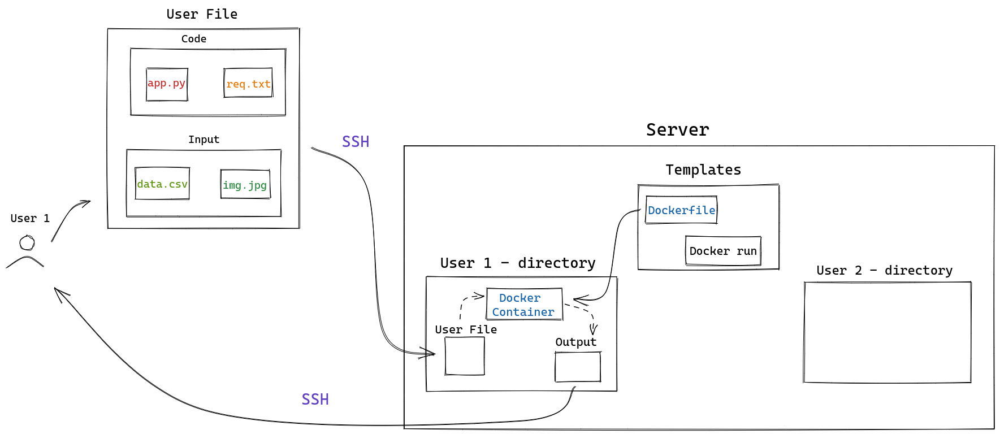

# NIAS-server

A schematic describing the server is illustrated below. 



## Overview

In this section we will follow the steps of general server operation, this server will support python and MATLAB programming languages:

1. The researcher must build a directory called project, inside his personal computer, containing all the files necessary for his project to run:
   - this directory must have two other directories inside of it, they must be called ``code`` and ``input``
   - Under ``code`` will be the ``app`` file, which will be the executable program, and ``requirements.txt``, intended to indicate the libraries used in the code.
   - The directory ``input`` will contain the data by the program as input, such as images or datasets

2. In order to run his project, the researcher must use ssh to get inside the server in his respective user. For doing that, the following command must executed:
   ```
   ssh -p PORT user@SERVERIP
   ```
   - Once the researcher enter in his user, he must execute the [`job`](job.sh) file (Described below) using the following command:
   ```
   ./job
   ```
3. With the comands in step 2, the server will copy the project file from the researcher's PC and create a new directory fot it within the user's home directory

4. After copying the project file, ter server will put the apropriate Dockerfile ([Python](dockerfiles/dockerfile-python) or [MATLAB](dockerfiles/dockerfile-matlab)) from the templates directory for the project directory

5. Using the Dockerfile and the project file, the server will build an image and run a container from it, generating output to the code
   - It is important that all the output which the researcher wish to have access must be send to a directory called `/output`, because this is the directory inside the container that is attached to the real storage within the server

6. Finally, the output generated by running the project container will be sent back to the researcher via ssh protocol
   - A directory called `output` will be created within the project directory on the researcher's PC to receive the project outputs

## User Registry

First of all, to use this server, the researcher must register it self in the server. To do so, one must ask for the server administrator to run the [user registry](user-record.sh) file. this file works as follows:

  1. Informations of the new user must be provided, such as:
     - A user name, made as follows: firstname-lastname
     - The name of the user in the researcher's personal computer
     - The port that reponds to ssh in the researcher's personal computer
     - A passphrase for building the ssh key
     - the UFV-VPN IP address of the resercher's PC (This IP address must be fixed)
     
  2. With the above information, a new user will be created, he will be part of the docker group in addition to his own. the user home directory will use [skel-client](skel-client) to be build, this directory will contain the [job](job.sh) file (described later) and .ssh directory.
 
  3. Inside [ssh](skel-client/.ssh) directory, the researcher's PC will be registered as a ssh host, in order to be accessed later, during the [job](job.sh) routine

  4. To finish the registration, the server adminitrator must get in the newly created user and execute the commands to generate a new ssh key, using the passphrase provided, and send the public key to the researcher's PC  

## Job
somethig
