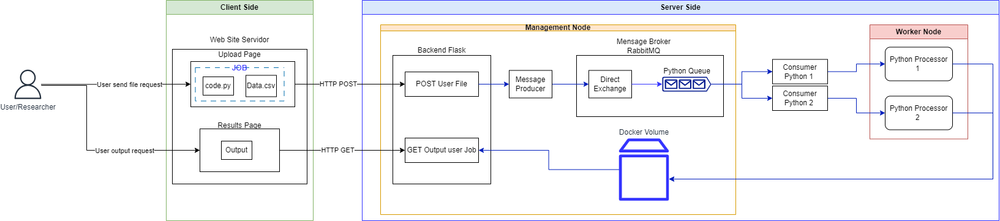

# NIAS server

A schematic describing the server is illustrated below. 



## Overview

### Project Goal

This project is a software developed within the framework of a Signal Analysis Research Lab. Its primary purpose is to facilitate the connection between laboratory researchers and a High-Performance Computing (HPC) server. This enables the execution of intricate signal processing scripts written in Python, designed to handle substantial volumes of data that would pose significant challenges if run on users' personal computers.

### Sorftware Usage

1. Running the Project Locally:
   - To run this project in a local environment, you only need to have Docker and Docker Compose installed on your machine.
   - Begin by cloning the project repository to a local directory.
   - Next, open a terminal within this directory and enter the command: ```docker-compose up```. This will automatically start the entire architecture, allowing the software to function seamlessly in your local environment.
     
2. The FrontEnd provides access to three essential pages:
   - HomePage: This is the system's initial page, serving as a gateway to the other two crucial pages within the system.
   - Upload: On this page, users can upload files containing the tasks they wish the server to process. The structure of these tasks will be detailed later in this document.
   - Results: This page displays the output generated by the tasks submitted by the researchers.

3. Uploading Jobs to the Server:
   - The file to be sent to the server as a job must be in the form of a compressed ```.zip``` directory.
   - This file's structure should, at a minimum, adhere to the following format:
   ```
   project-name
   │
   ├── code.py
   ├── requirements.txt
   ├── output
       └── Job Results
   ```
      - The ```project-name``` is used as the unique identifier for the job; hence, it must be distinct and one-of-a-kind. 
      - ```code.py``` serves as the executable for the researchers' data processing algorithm. Additional files, such as supporting classes, may exist, but these must be invoked by ```code.py```.
      - in order to build the ``requirements.txt`` you will have to find out which versions of python libraries your machine is using. To do this, use the following lines of code inside the terminal (put exactly the same output in the ``requirements.txt`` file):
         - For linux operating systems or online jupyter notebooks like google colab or Kaggle (use "!" at the beginning of the line of code if you are using online jupyter notebooks)  
            ```
            pip freeze list | grep <libraryname>
            ```
         - For windows operatiing systems using powershell
            ```
            pip freeze list | Select-String <libraryname>
            ```
         
      - The ```Output``` folder is where the scripts' results must be deposited. The software will exclusively return items located within this folder as the job results.

4. To retrieve Job Results:
   - Accessing the Results page will provide you with all the outcomes generated by the jobs submitted to the server.
   - These results will be organized and associated with their respective jobs based on the ```project-name```.

## Functional description
This software was developed utilizing a microservices architecture, where each component operates as an independent Docker container, interconnected through a bridge network established and orchestrated by Docker Compose. The system employs a RabbitMQ queue to decouple interactions between users and the processing units on the server.

1. [Backend](web-server/server-web-page)
   - Developed using Python with the Flask framework.
   - User jobs are submitted to the server via a POST endpoint on the backend, which forwards the compressed file to a message producer.
   - Results are obtained through a GET endpoint, which queries a volume containing the job results generated by the server's processing units.


## Next Steps

This is a first version of the server, therefore, there is a lot of room to improve and adjust some possible issues. this section will talk about some of these possible improvements and adjustments. 

 - [ ] Analyze possible problem thet researchers are likely to have with opening ports on their routers
 
 - [ ] Use a second machine connected to the current one to build a cluster
 
 - [ ] Use pipelines to allow user to use send new jobs for the server only by commiting to github  
